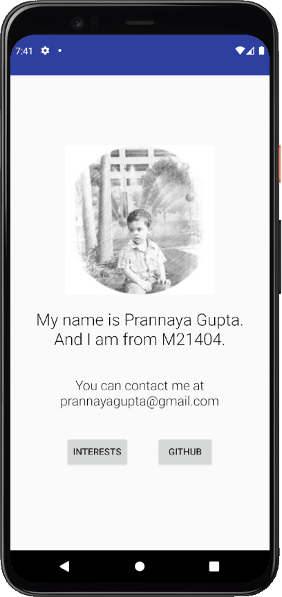
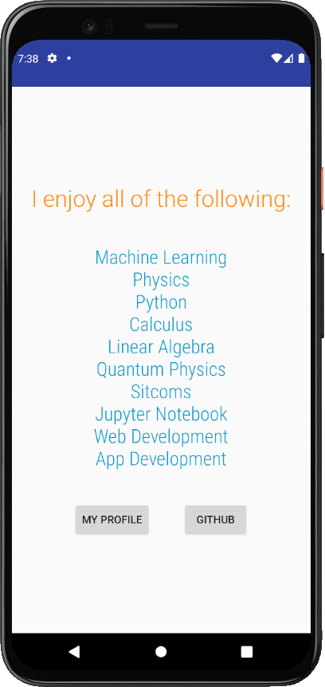
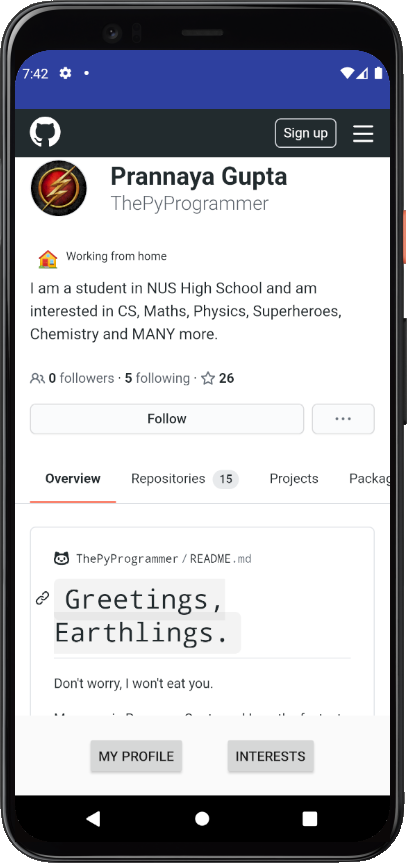

# Android Self Introduction App
**Done by Prannaya Gupta**

Part of Lab 0 in the CS4131 Module at NUS High School

This application shows a profile for myself, showing a simplistic main profile, a page for interests and a view for my GitHub profile.

While rather simplistic, this app serves as an introduction for me to Android App Development, and I would like to thank Mr Ng for setting this interesting lab for me and my fellow students.

## What the app looks like

### Main Profile Page

This main page shows my name, class and contact info. For the sake of privacy, the details have been tweaked slightly.

### Interests Page

This page lists my interests, in no particular order. 

### GitHub Profile Page

You can also access my GitHub profile page, although this requires a stable internet connection.

All images are shown on a Google Pixel 4 Emulator running Android 11.
